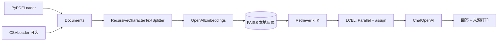

# 基于私有知识库的智能 S&OP 业务助手 — 技术说明

## 1. 概述

`w2.py` 实现「外部 PDF（可选 CSV）→ 文本切块 → 硅基流动兼容的 Embedding → 本地 FAISS 持久化 → 语义检索 Top-K → LCEL 拼装 Prompt → 大模型回答 → 打印参考来源」的 RAG 闭环。严格约束模型仅依据检索上下文作答，无法命中时输出固定句式。

## 2. 运行环境与依赖

| 组件 | 说明 |
|------|------|
| Python | 建议 3.10+ |
| `python-dotenv` | 从 `.env` 加载密钥与 `base_url` |
| `langchain-core` / `langchain-community` / `langchain-openai` / `langchain-text-splitters` | LCEL、Loader、FAISS、OpenAI 兼容接口 |
| `faiss-cpu`（或 `faiss-gpu`） | 本地向量索引 |

在项目根目录配置 `.env`（示例字段名与脚本一致）：

- `api_key`：API Key  
- `base_url`：OpenAI 兼容网关根地址（如硅基流动）  
- 可选：`SOP_CHAT_MODEL`、`SOP_EMBED_MODEL`、`SOP_EMBED_CHUNK_SIZE`、`SOP_DOCS_DIR`（知识库目录）、`SOP_CHUNK_SIZE`、`SOP_CHUNK_OVERLAP`、`SOP_VECTORSTORE_DIR`、`SOP_INCREMENTAL`（`1`/`0` 是否启用增量更新）、`SOP_RETRIEVER_K`（默认送入模型的块数，如 `8`）、`SOP_USE_MMR`（默认 `1`）、`SOP_RETRIEVER_FETCH_K`（MMR 候选池大小，默认约 `max(5*k,30)`）、`SOP_MMR_LAMBDA`（MMR 多样性，默认 `0.55`）

安装依赖示例：

```bash
pip install python-dotenv langchain-core langchain-community langchain-openai langchain-text-splitters faiss-cpu
```

## 3. 程序入口与命令行

```text
python w2.py [--dir DIR] [-r] [--rebuild] [--k N]
```

| 参数 | 含义 |
|------|------|
| `--dir` | 知识库目录，加载其中全部 `.pdf` 与 `.csv`；默认 `sop_knowledge`（可用 `SOP_DOCS_DIR`） |
| `-r` / `--recursive` | 递归子目录 |
| `--rebuild` | 强制全量重建（忽略清单指纹与增量）；平时由 `ingest_manifest.json` 与内容 SHA256 决定是否复用索引 |
| `--k` | 送入模型的检索块数量，默认 `8`（可用 `SOP_RETRIEVER_K`）；复杂问答建议 ≥6，避免答案句落在未召回的块里 |
| `--similarity` | 关闭 MMR，仅用相似度 Top-K（默认启用 MMR，见 §6 说明） |

交互：启动后在终端输入问题，输入 `quit` 或 `exit` 退出。

## 4. 模块结构与数据流



## 5. 对外可视为「接口」的函数说明

以下为脚本内主要可复用单元（非 HTTP API，均为 Python 函数契约）。

### 5.1 `load_pdf_documents(pdf_path: str) -> List[Document]`

- **作用**：调用 `langchain_community.document_loaders.PyPDFLoader` 加载 PDF。  
- **元数据**：为每条 `Document` 补充 `source`、`doc_type="pdf"`（若缺失）。  
- **异常**：文件不存在时由 `PyPDFLoader` / OS 抛出。

### 5.2 `load_csv_documents(csv_path: str) -> List[Document]`

- **作用**：`CSVLoader` 按行转为 `Document`，编码默认 `utf-8`。  
- **元数据**：`source`、`doc_type="csv"`。

### 5.3 `load_documents_from_dir(docs_dir, recursive) -> List[Document]`

- **作用**：扫描目录下全部 PDF/CSV 并合并为 `Document` 列表；在返回前调用 `apply_kb_provenance_metadata`，为每条文档写入溯源字段（见 **§8**）。  
- **异常**：目录不存在或无可入库文件时抛出 `FileNotFoundError`。

### 5.4 `scan_files_sha256` / `compute_content_fingerprint`

- **作用**：对每个入库文件计算内容 SHA256，再与嵌入模型名、`SOP_CHUNK_SIZE`/`SOP_CHUNK_OVERLAP`、目录绝对路径、是否递归等一起生成**总指纹** `content_fingerprint`（写入 `ingest_manifest.json`）。任一源文件变更或配置变更都会使指纹变化。

### 5.5 `split_documents(docs, ...) -> List[Document]`

- **作用**：`RecursiveCharacterTextSplitter`；默认块大小与重叠由 `SOP_CHUNK_SIZE` / `SOP_CHUNK_OVERLAP` 控制。

### 5.6 `build_vector_database(docs_dir, recursive, force_rebuild) -> Optional[FAISS]`

- **启动时控制台输出（哈希比对）**：在分支判断前先打印两行十六进制指纹：  
  - **当前知识库哈希码**：由 `compute_content_fingerprint` 根据当前磁盘上各文件内容 SHA256 与配置算出；  
  - **本地存储哈希码**：来自 `ingest_manifest.json` 中的 `content_fingerprint`；若无清单则显示「尚无清单或无法读取」。  
  随后打印 **判定**：若与清单一致且可加载索引 →「一致 → 直接加载向量库，跳过建库」；否则 →「不一致或需要重建 → 将更新向量库」。建库或增量结束后，再打印 **更新后本地存储哈希码**（应与当前知识库哈希码相同）。
- **指纹一致**：`index.faiss` 与 `ingest_manifest.json` 存在，且 `content_fingerprint` 与当前磁盘一致 → 直接 `load_local`，**不读 PDF、不调 Embedding**。  
- **指纹不一致且允许增量**（默认 `SOP_INCREMENTAL=1`）：在清单与配置可衔接的前提下，对已删除/修改文件 `delete` 其向量 id，仅对**新增或内容变更文件**切块并 `add_documents`；未改动的文件**不重复请求 Embedding**。  
- **全量重建**：`--rebuild`、`SOP_INCREMENTAL=0`、无旧清单、增量失败或配置不兼容时，目录内全部文件重新切块并向量化。  
- **清单字段**：每个源文件相对路径对应 `sha256` 与 `vector_ids`（FAISS 中文本块的 doc id 列表），供增量删除与溯源。

### 5.7 `apply_kb_provenance_metadata` / `format_provenance_line`

- **`apply_kb_provenance_metadata(docs, docs_dir_abs, recursive)`**：在 Loader 产出后、`split_documents` 之前写入 PDF/CSV 的**文件名、页码/行号**等字段（键名见 **§8**）。  
- **`format_provenance_line(doc)`**：格式化为一句溯源，例如「《手册 B.pdf》第 5 页」「《数据.csv》第 12 行」；若缺少新字段（旧索引），则回退到「《文件名》」或路径。

### 5.8 `format_docs(docs: List[Document]) -> str`

- **作用**：为每个检索块生成一行 `[参考：{溯源句}]` 后再接 `page_content`，块与块之间双换行，作为 Prompt 中的 `{context}`，使模型与用户可见信息对齐。

### 5.9 `build_retrieval_runnable(retriever)` / `stream_rag_answer`

- **LCEL**：`RunnableParallel(retrieved_docs=retriever, question=...)` → `assign(context=...)`；回答阶段对 `RAG_PROMPT | llm | StrOutputParser()` 使用 **`.stream()`** 流式输出。

### 5.10 `print_sources(retrieved_docs, top_k)`

- **作用**：每条参考打印 **溯源**（`format_provenance_line`）、**文件路径**、**片段摘要**（前 120 字），实现「PDF/CSV **文件名** + 页/行」级定位。

## 6. 所调用的 LangChain / 生态 API 一览

| 类别 | 类 / 函数 | 用途 |
|------|-----------|------|
| 加载 | `PyPDFLoader` | PDF → `Document` |
| 加载 | `CSVLoader` | CSV → `Document`（可选） |
| 切分 | `RecursiveCharacterTextSplitter` | 长文档切块 + overlap |
| 向量 | `OpenAIEmbeddings`（OpenAI 兼容） | 文本 → 向量；`chunk_size` 对齐网关单次批量上限 |
| 存储 | `FAISS.from_documents` / `add_documents` / `delete` / `save_local` / `load_local` | 本地向量库持久化；增量时对变更文件删旧加新 |
| 检索 | `FAISS.as_retriever`（默认 `search_type="mmr"`） | 先从较大候选集 `fetch_k` 里做 **MMR**，再取 `k` 条，减轻「Top-K 彼此太像、互补信息进不了上下文」导致的漏答；可用 `SOP_USE_MMR=0` 或命令行 `--similarity` 改回纯相似度 Top-K |
| 模型 | `ChatOpenAI` | 对话生成（`streaming=True`，链上对回答做流式输出） |
| LCEL | `RunnableParallel`、`RunnablePassthrough`、`StrOutputParser` | 检索与生成编排 |

## 7. 目录与文件约定

| 路径 | 说明 |
|------|------|
| `sop_knowledge/`（默认） | 存放多个 PDF/CSV 的知识库目录（`SOP_DOCS_DIR` / `--dir`） |
| `local_faiss_index/` | 默认向量库目录（`index.faiss`、`index.pkl` 等） |
| `local_faiss_index/ingest_manifest.json` | 内容指纹、每源文件 `sha256` 与 `vector_ids`，用于判断是否直接加载或增量更新 |

## 8. 切块溯源设计（可维护约定）

多文件知识库下，检索命中的是「文本块」，必须在 **写入向量库前** 把「人类可理解的坐标」写进 `Document.metadata`，并保证切块后仍带在身上。实现要点如下。

### 8.1 元数据键名（代码中集中定义为常量）

| 键名 | 含义 |
|------|------|
| `kb_source_kind` | `"pdf"` 或 `"csv"` |
| `kb_page_display` | PDF **人类可读页码**（从 1 开始），由 PyPDFLoader 的 `page`（0-based）+1 得到 |
| `kb_source_basename` | 文件名（`os.path.basename(source)`），溯源展示为《文件名》第 n 页/行 |
| `kb_row_display` | CSV 行号展示值（在 Loader 提供 `row` 元数据时，按 0-based 下标 +1 转为可读行号） |

**维护建议**：若需增加字段（如「章节标题」），只在本表与 `w2.py` 顶部常量区同步扩展，并在 `apply_kb_provenance_metadata` / `format_provenance_line` 中统一处理。

### 8.2 溯源展示（文件名优先）

终端与 Prompt 内嵌上下文统一使用 **`《文件名》第 n 页`**（PDF）或 **`《文件名》第 n 行`**（CSV），**不再使用「第几个 PDF」序号**，避免与人工对文件名的心智模型不一致；多文件时以**文件名**区分来源。

### 8.3 页码与切块

- PyPDFLoader 通常**每页一个** `Document`，`metadata["page"]` 为从 0 起的页索引。  
- `apply_kb_provenance_metadata` 写入 `kb_page_display = int(page) + 1`。  
- `RecursiveCharacterTextSplitter.split_documents` 会把**父文档的 metadata 复制到每个子块**，因此同一页被切成多块时，各块共享同一 `kb_page_display` 与 `kb_source_basename`，仍指向「该 PDF 该页」的内容片段。  
- 若未来换用「整本一个 Document」的 Loader，需在切分前自行拆成按页 Document 或增加页级元数据，否则无法做到页级溯源。

### 8.4 与 Prompt、终端输出的关系

- `format_docs` 在每个文本块前加 `[参考：{溯源句}]`，便于模型在上下文中看到明确出处。  
- `print_sources` 再次输出溯源句与绝对路径，便于人工核对原始 PDF/CSV。

## 9. 故障与注意事项

- **首次运行前**：在知识库目录中放入至少一个 PDF 或 CSV。  
- **更换 Embedding 模型或切块参数**：指纹会变；若增量失败可 `python w2.py --rebuild` 全量重建。  
- **仅增加一个文件**：默认走增量，只为新文件（及被修改的文件）请求 Embedding，其余向量复用。  
- **硅基流动等网关**：Embedding 单次批量大小受限时，通过 `SOP_EMBED_CHUNK_SIZE`（默认 32）与 `OpenAIEmbeddings` 的 `chunk_size` 对齐。  
- **安全**：`load_local` 使用 `allow_dangerous_deserialization=True` 仅适用于本地可信索引目录。  
- **旧向量库**：若索引建于溯源字段加入之前，块内可能缺少 `kb_*`；`format_provenance_line` 会尽量用 `source` 与 `page` 回退显示，建议重建一次索引以写入完整溯源元数据。  
- **参考来源看起来相关，但模型仍答「知识库中没有相关信息」**：多为 **k 太小** 或 **Top-K 块过于相似**（关键句落在未选中的块里）。已默认采用 **MMR + 较大 k**；仍不满意时可增大 `SOP_RETRIEVER_K` / `SOP_CHUNK_SIZE`（需 `--rebuild`）或调高 `fetch_k`。PDF 版式导致 **PyPDF 抽字断行/缺字** 时，语义检索也会变差，可考虑换 OCR Loader 或清洗文本。

---

*文档版本与 `w2.py` 实现保持一致；若修改链路与环境变量名，请同步更新本文。*
