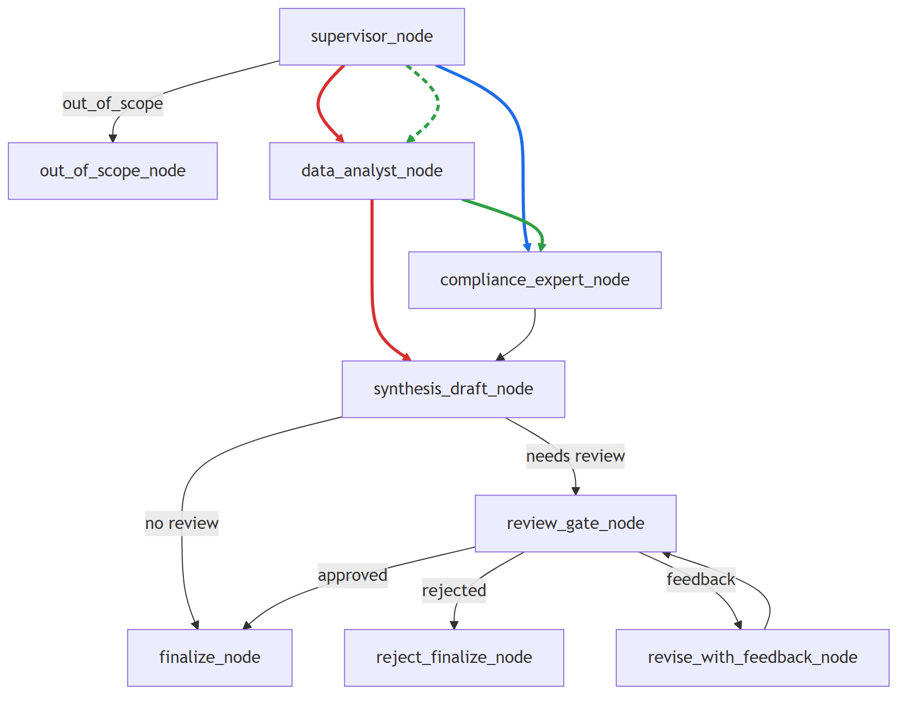

# Agentic S&OP Enterprise

企业级 S&OP 决策系统，面向“SQL 数据分析 + 制度校验 + 审批治理”场景。  
系统提供标准 API 与业务前端，支持快速部署和稳定交付。

---

## 核心能力

- **业务域边界控制**：仅处理企业 `PDF` 制度语料与 `CSV` 业务数据覆盖的问题。  
- **多节点决策编排**：通过 LangGraph 固化决策流程，避免黑盒式执行。  
- **SQL-Text AI 分析**：数据节点将自然语言问题转换为 SQL，并且仅以只读账号执行。  
- **混合检索**：制度检索采用 `FAISS + BM25` 融合，提升召回与稳健性。  
- **审批闭环**：高风险建议自动进入人工审批，可同意、驳回或补充意见。  
- **可追溯输出**：结果附带依据来源，支持审计与复盘。

---

## 系统架构



---

## 项目结构

```text
final_enterprise/
├── README.md
├── .env.example
├── data/
│   ├── *.pdf
│   └── sales_performance.csv
├── backend/
│   ├── main.py                # FastAPI 入口
│   ├── workflow.py            # LangGraph 流程编排
│   ├── analytics.py           # SQL-Text AI 数据分析
│   ├── compliance.py          # 制度检索与风险判定
│   ├── runtime.py             # 运行时装配
│   ├── history_store.py       # 会话历史持久化
│   ├── database.py            # 数据库连接
│   ├── seed_data.py           # 初始化数据
│   ├── config.py              # 配置
│   ├── smoke_test.py          # 冒烟测试
│   └── requirements.txt
├── frontend/
│   ├── app.py                 # 业务前端
│   └── requirements.txt

```

---

## 部署说明

### 1) 安装依赖

```powershell
cd C:\Users\ROG\Desktop\langchain_learnning\final_enterprise
pip install -r backend\requirements.txt
pip install -r frontend\requirements.txt
```

### 2) 配置环境变量

复制 `final_enterprise/.env.example` 为 `final_enterprise/.env`。  

### 3) 启动后端

```powershell
cd backend
uvicorn main:app --host 127.0.0.1 --port 8100
```

首次部署建议先执行 MySQL 初始化脚本（见 `backend/sql/init_test_data.sql`），再可选执行：

```powershell
python seed_data.py
```

### 4) 启动前端

```powershell
cd ..\frontend
streamlit run app.py --server.port 8600
```

访问地址：`http://127.0.0.1:8600`

---

## 核心接口

- `GET /health`：健康检查  
- `POST /graph/chat`：发起决策流程  
- `POST /graph/resume`：处理审批后恢复流程  
- `GET /graph/state`：查询流程状态  
- `GET /graph/pending_approvals`：查询待审批会话  
- `GET /session/history`：查询会话历史  
- `GET /sources/catalog`：查询可用数据与表目录  

---

## 数据与执行安全

- 数据分析仅允许 `SELECT/WITH SELECT`，拒绝写操作与 DDL。
- SQL 仅允许访问业务白名单表（默认 `sales_performance`）。
- AI 查询必须使用只读账号（`MYSQL_RO_USER/MYSQL_RO_PASSWORD`），未配置则拒绝启动。

---

## 关于状态保存

- `Graph State Memory` 用于保存当前运行中的图状态（含中断恢复所需信息）。
- 该状态在服务进程内有效，进程重启后会清空。
- 会话消息历史持久化在 MySQL（`chat_messages` 或你的配置表）。

---

## 运行验证

```powershell
cd backend
python smoke_test.py
```

通过后即可进入联调与业务验收。
