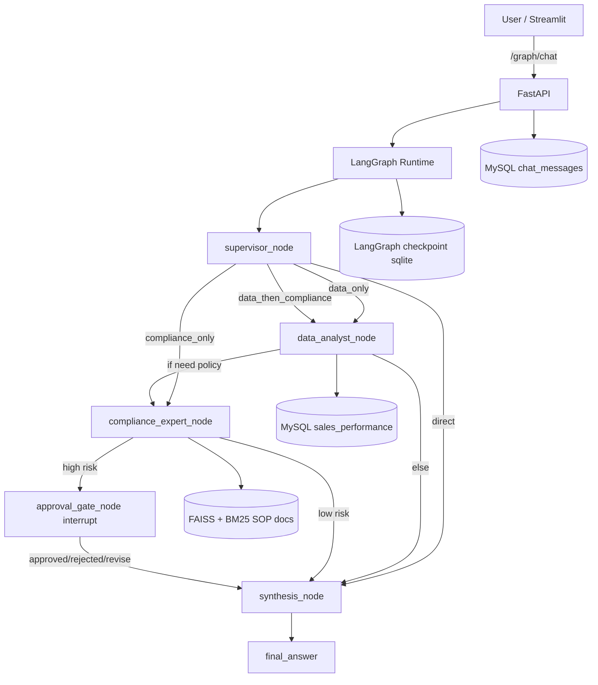

# Agentic S&OP 智能决策系统（LangGraph 企业版）

这是毕业项目最终阶段的交付版本：将单体 Agent 升级为 **LangGraph 多智能体状态机**，并落地 **Human-in-the-loop（HITL）人工审批**，支持 FastAPI + Streamlit 端到端演示。

---

## 1. 项目目标（对应答辩 OKR）

### OKR-1：掌握 LangGraph（State / Nodes / Edges）
- 使用 `StateGraph` 显式定义执行流，替代黑盒单体 Agent。
- 引入 `supervisor_node` 条件路由，支持 `data_only / compliance_only / data_then_compliance / direct`。
- 提供节点轨迹 `node_trace`，支持现场解释“为什么这样走图”。

### OKR-2：落地 Human-in-the-loop
- 在 `approval_gate_node` 使用 `interrupt(...)` 打断执行。
- 前端收到 `interrupted` 后展示“同意/驳回/修改”按钮。
- 通过 `/graph/resume` 恢复流程并生成最终报告。

### OKR-3：产品级交付
- 后端：`FastAPI + LangGraph + SQLChatMessageHistory + Text-to-SQL`
- 前端：`Streamlit`，支持会话恢复、节点轨迹、待审批队列。
- 增加 `smoke_test_langgraph.py` 一键冒烟脚本，便于验收与演示彩排。

---

## 2. 架构总览



---

## 3. 代码结构（W6）

```text
w6/
├── README.md
├── 启动与验证.md
├── backend/
│   ├── main.py                    # FastAPI API + graph endpoints
│   ├── agent_runtime.py           # runtime bootstrap + tool wiring
│   ├── langgraph_workflow.py      # StateGraph / nodes / HITL interrupt
│   ├── sql_agent_tool.py          # Text-to-SQL tool (read-only guard)
│   ├── sql_history.py             # SQLChatMessageHistory (MySQL)
│   ├── db_config.py               # MySQL engines + readonly SQL guard
│   ├── import_csv_to_mysql.py     # CSV -> sales_performance
│   ├── smoke_test_langgraph.py    # end-to-end smoke test
│   └── requirements.txt
└── frontend/
    ├── app.py                     # Streamlit UI + approval controls
    └── requirements.txt
```

---

## 4. 核心状态定义（可答辩讲解）

`WorkflowState` 关键字段：
- `user_query`：用户问题原文
- `intent` / `route_plan`：主管节点判定结果
- `sql_result`：数据节点输出
- `compliance_result`：合规节点输出
- `requires_human_approval` / `approval_decision`
- `final_answer`
- `node_trace`：节点轨迹（演示时最有说服力）

---

## 5. API 清单（新增 Graph 能力）

### 原有对话接口
- `POST /chat`
- `POST /chat/stream`
- `GET /session/history`
- `POST /session/reset`

### 新增 LangGraph 接口
- `POST /graph/chat`  
  启动一次图执行，返回 `completed` 或 `interrupted`。
- `POST /graph/resume`  
  用人工决策恢复中断流程（`approved/rejected/revise`）。
- `GET /graph/state?session_id=...`  
  读取线程快照、`brief` 摘要与轨迹。
- `GET /graph/pending_approvals`  
  读取待审批队列（用于运维看板/前端侧边栏）。
- `GET /session/list`  
  读取最近会话列表（含消息数）。

---

## 6. 运行步骤（最短路径）

1) 安装依赖

```powershell
cd C:\Users\ROG\Desktop\langchain_learnning
.\.venv\Scripts\Activate.ps1
pip install -r requirements.txt
pip install -r w6\backend\requirements.txt
pip install -r w6\frontend\requirements.txt
```

2) 导入业务数据

```powershell
cd w6\backend
python import_csv_to_mysql.py --drop
```

3) 启动后端

```powershell
cd C:\Users\ROG\Desktop\langchain_learnning\w6\backend
uvicorn main:app --host 0.0.0.0 --port 8000
```

4) 启动前端

```powershell
cd C:\Users\ROG\Desktop\langchain_learnning\w6\frontend
streamlit run app.py --server.port 8501
```

---

## 7. 一键验收脚本（推荐答辩前必跑）

后端启动后执行：

```powershell
cd C:\Users\ROG\Desktop\langchain_learnning\w6\backend
python smoke_test_langgraph.py --api http://127.0.0.1:8000
```

脚本会自动验证：
- `/health`
- `graph/chat` 常规路径
- `graph/chat` 强制审批路径（`[force_approval]`）
- `graph/resume` 恢复执行
- `/graph/state` 最终状态

---

## 8. 演示脚本（3~5 分钟）

### 场景 A：跨节点接力
提问：
> 上个月准确率是多少？对此应该采取什么措施？

讲解点：
- 先走 `data_analyst_node` 查询指标；
- 再把指标传给 `compliance_expert_node` 检索措施；
- 最后 `synthesis_node` 汇总。

### 场景 B：人工审批中断
提问：
> [force_approval] 请给出库存削减建议并先人工审批

讲解点：
- 流程被 `interrupt` 挂起；
- 前端出现审批按钮；
- 点击“同意/驳回/修改”后 `/graph/resume` 继续。

### 场景 C：稳定性与安全
- 展示 SQL 只读防护（拒绝 DELETE/UPDATE）。
- 展示 `node_trace` 与 `pending approvals` 队列。

---

## 9. 企业级防护与可维护性

- **零写操作防护（数据库）**
  - LLM 提示词禁止写 SQL
  - SQL 预检拒绝危险关键字
  - SQLAlchemy `before_cursor_execute` 兜底拦截
- **可恢复执行（流程）**
  - LangGraph checkpoint（sqlite）持久化线程状态
- **可观测性**
  - `node_trace`、`/graph/state`、`/graph/pending_approvals`
- **兼容回退**
  - 保留 `/chat` 与 `/chat/stream`，迁移风险低

---

## 10. 验收标准映射

1) **绝对稳定**：有状态图与条件边，避免单体 Agent 无限制工具循环。  
2) **人工干预**：审批中断可视化，可恢复。  
3) **企业级规范**：代码分层明确、接口完整、日志与诊断接口可用、带冒烟测试。

---

## 11. 下一步优化（可做加分项）

- 把 `pending approvals` 做成独立管理页（分页 + 检索 + SLA）。
- 引入 Prometheus 指标（节点耗时、审批等待时长）。
- 增加 `pytest` 集成测试，纳入 CI。
